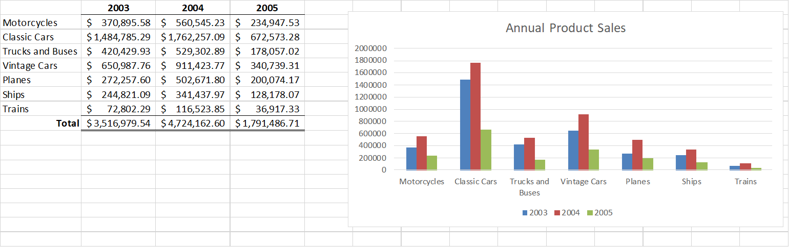
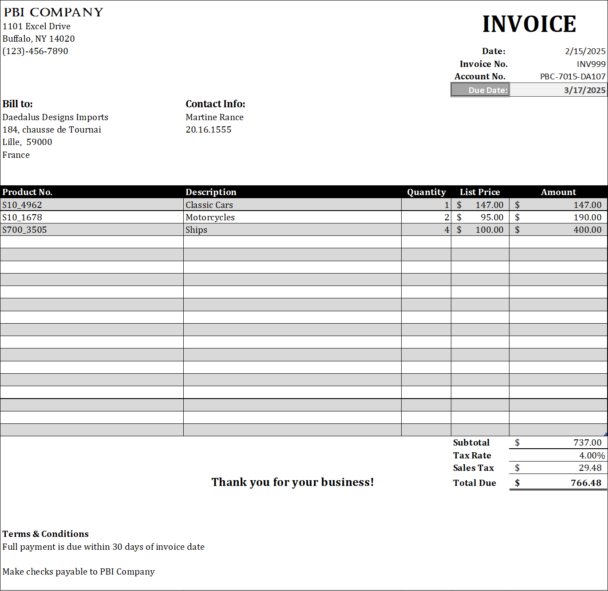

Sales Sample Analysis
================
Leopoldine Mirtil

### Data Source  

This project uses the Sales Sample data set which was made publicly available by user Gus Segura on
 Kaggle.com on June 2014, [link here](https://www.kaggle.com/datasets/kyanyoga/sample-sales-data).
This data was originally created by Maria Carina Roldan, Pentaho Community Member, BI consultant 
 (Assert Solutions), Argentina.

### Objective

The aim of this project is to perform a basic sales analysis using Excel 2016. 

### Sheet Summaries

#### Sales by Customers

Created two sales tables on this sheet. The first table shows the total sales per customers.
The sales amount was calculated using this formula: 

        {=SUMIF(sales_data_sample!$N:$N,A2, sales_data_sample!$E:$E)}

<!-- -->

The second table ranks the top ten customers by total sales. First, the top ten highest sale amounts 
were identified using the following formula: 

        {=LARGE($B$2:$B$93, $D2)}

Then the sales amount was matched with the customer's name using this formula: 

        {=INDEX($A$2:$A$93, MATCH($F2, $B$2:$B$93, 0))}

Due to the table layout and the VLOOKUP limitation where the lookup value must be to the left of 
the return value, I used INDEX and MATCH to identify the top ranked customer names. 

<!-- -->

#### Annual Product Sales

The table shows the annual product sales which was calculated using this formula: 

        {=SUMIFS(sales_data_sample!$E:$E, sales_data_sample!$K:$K, $A2, sales_data_sample!$J:$J, B$1)}

The annual totals were calculated with SUM and a clustered bar chart to visualizes the table.

<!-- -->

#### Sales by Country

A pivot table showing the total sales by country along with a side bar column chart. 
chart.

<!-- -->

#### Product Sales & Quantity
A pivot table for the total product sales and quantity and a line and bar combination 
chart to visualize the table.

<!-- -->

#### Sales Invoice

A sales invoice form for a fictional company that can be filled out and it also generates an automated 
invoice number after each save, which was made using VBA. 

I created two reference sheets ('Customer Info' & 'Product List') for use in calculations and in data validation
selections. To complete the form, select the 'Account No' which fills out the 'Bill to:' 
and 'Contact Info:' sections. Select the 'Product No.' of the desired products from drop down to generate the product 
description and price, then enter the quanitity and the total amount due, including taxes, will be shown at the 
bottom of the invoice. 

<!-- -->

Below are the formulas used for each invoice section.

  * Date     

        =TODAY()

  * Invoice No.     
  
        =CONCATENATE("INV", $F$4)
F4 holds the initial number used for the invoice number generator. 

  * Due Date 
    
        =E4+30      

  * VBA code   
        
        Private Sub Workbook_Open()
        Range("F4").Value = Range("F4").Value + 1
        End Sub

  * Bill to

        Company Name               =IF(ISBLANK($E$6), "", VLOOKUP($E$6, 'Customer Info'!$A$1:$L$93, 2, FALSE))
        Address Line 1             =IF(ISBLANK($E$6), "", VLOOKUP($E$6, 'Customer Info'!$A$1:$L$93, 4, FALSE))
        Address Line 2             =IF(ISBLANK($E$6), "", IF(VLOOKUP($E$6, 'Customer Info'!$A$1:$L$93, 5, FALSE)=0, CONCATENATE(VLOOKUP($E$6, 'Customer Info'!$A$1:$L$93, 6, FALSE), ", ", VLOOKUP($E$6, 'Customer Info'!$A$1:$L$93, 7, FALSE), " ", VLOOKUP($E$6, 'Customer Info'!$A$1:$L$93, 8, FALSE)), VLOOKUP($E$6, 'Customer Info'!$A$1:$L$93, 5, FALSE)))      
        City,State,Postal Code     =IF(ISBLANK($E$6), "", IF(VLOOKUP($E$6,'Customer Info'!$A$1:$L$93,5,FALSE)=0,VLOOKUP($E$6,'Customer Info'!$A$1:$L$93,9,FALSE),CONCATENATE(VLOOKUP($E$6,'Customer Info'!$A$1:$L$93,6,FALSE),", ",VLOOKUP($E$6,'Customer Info'!$A$1:$L$93,7,FALSE)," ",VLOOKUP($E$6,'Customer Info'!$A$1:$L$93,8,FALSE)))) 
        Country                    =IF(ISBLANK($E$6), "", IF(VLOOKUP($E$6, 'Customer Info'!$A$1:$L$93, 5, FALSE)=0, "", VLOOKUP($E$6, 'Customer Info'!$A$1:$L$93, 9, FALSE)))
   
  * Contact Info

          Contact name      =IF(ISBLANK($E$6), "", CONCATENATE(VLOOKUP($E$6, 'Customer Info'!$A$1:$L$93, 12, FALSE), " ", VLOOKUP($E$6, 'Customer Info'!$A$1:$L$93, 11, FALSE)))
          Phone Number      =IF(ISBLANK($E$6), "", VLOOKUP($E$6, 'Customer Info'!$A$1:$L$93, 3, FALSE))

  * Description    
  
         =IF(ISBLANK($A16),"",VLOOKUP($A16,'Products List'!$A$1:C110,2,FALSE))
  * List price     

        =IF(ISBLANK($A16),"",VLOOKUP($A16,'Products List'!$A$1:C110,3,FALSE))
  * Amount    

        =IF(ISBLANK($A16), "", [@Quantity]*[@[List Price]])
	
					
<!-- -->
